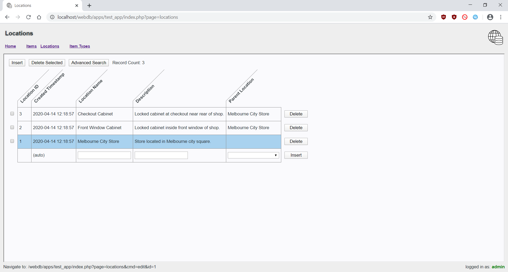
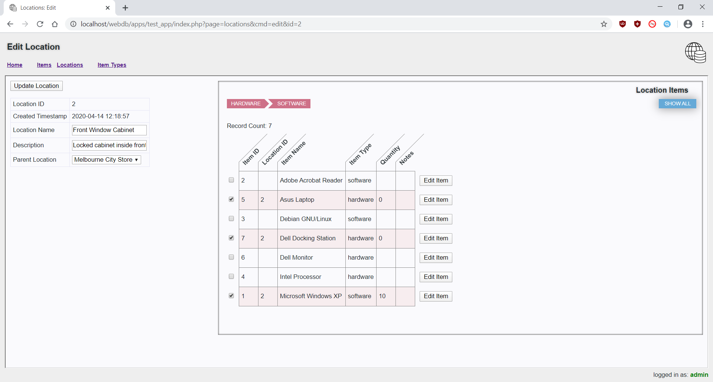

# webdb

Framework for building low/no-code web-based database applications.

Based on this framework, you can create a complete web-based database application with a handful of JSON-formatted form configuration files, a couple of settings and a SQL schema.

[setup guide](doc/setup.txt)

[sample application directory](apps/test_app/)

[various other guides](doc/)

Visit the Freenode project channel: #webdb
Join the Discord server: https://discord.gg/9AmUP4K

